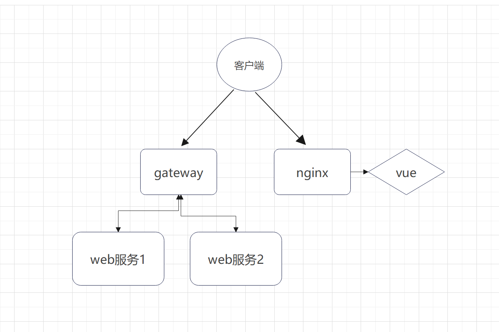

# background-system

**这是一个前后端分离的后台系统，拥有完整的体系，主要用于二次开发，相比于低代码开发，该系统的作用就是让程序员感受到自己敲代码的快乐**


**优点：干净，清晰，整洁**


**在该系统开发一个前后端分离页面有多简单?**

**像数123一样简单**


## background-system-server

### 统一响应格式

```json
{
    "code": 200,
    "message": "成功",
    "data": null
}
```

code：响应状态码（严格遵循http状态码规范）

message：服务器附带的一些消息

data：响应的数据


### 启动

搭建环境：jdk1.8 + Maven + Mysql + Redis

导入sql文件

运行WebApplication


## background-system-web

环境：node.js + vue2


### 下载依赖

```bash
yarn
```


### 启动

```bash
yarn serve
```


# 架构部署建议


